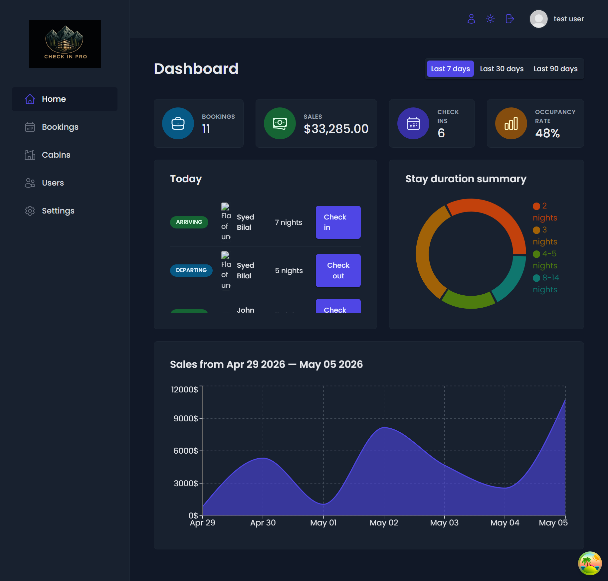
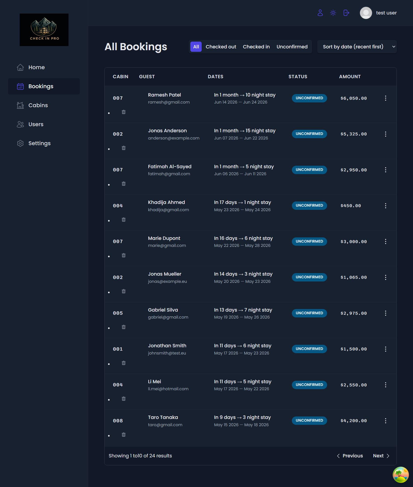
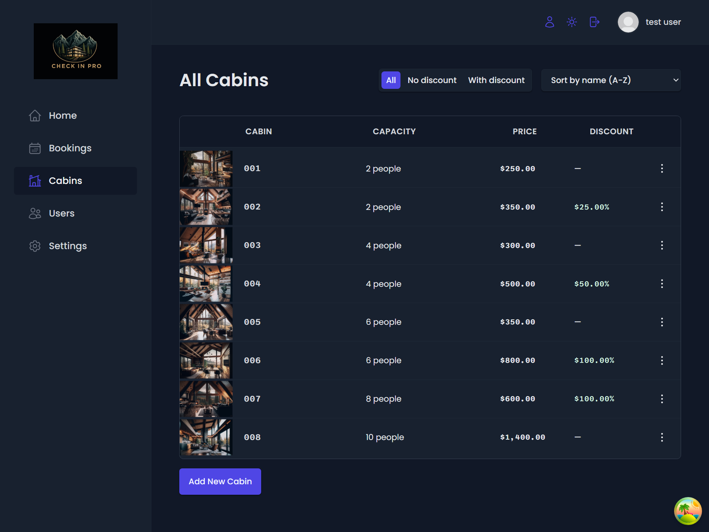
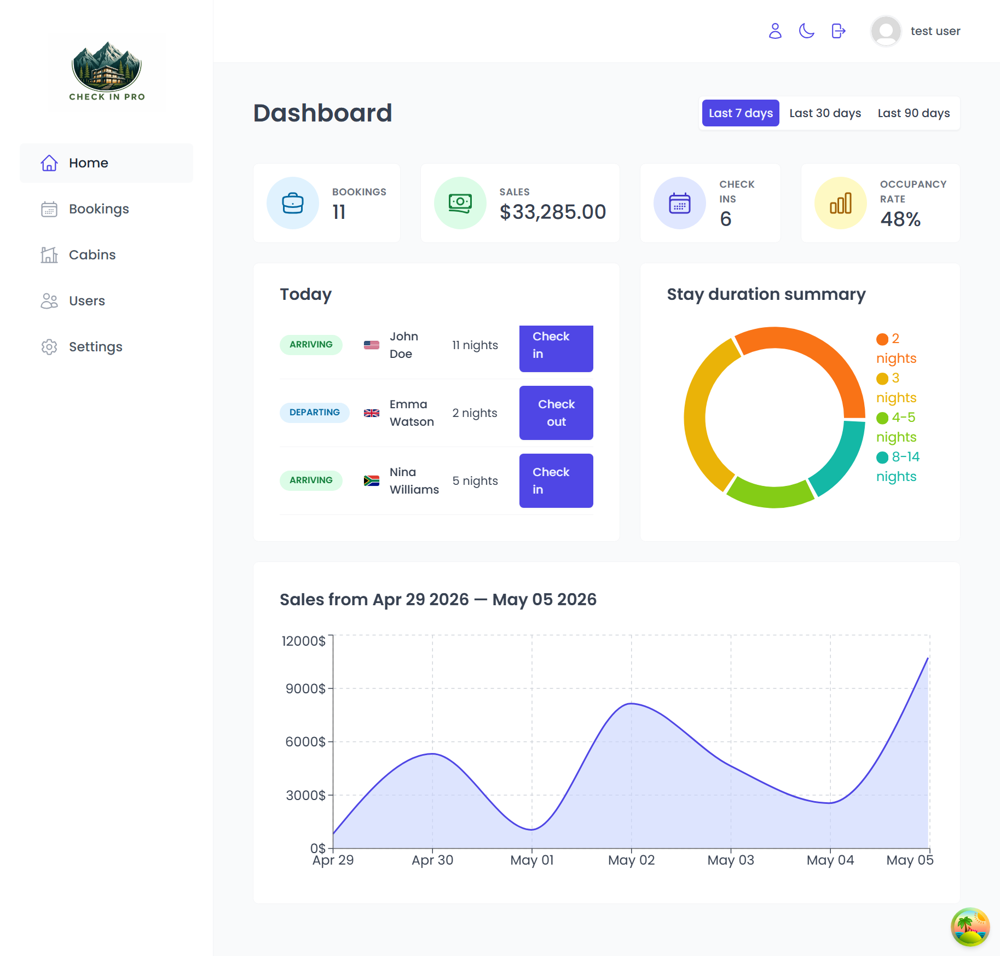
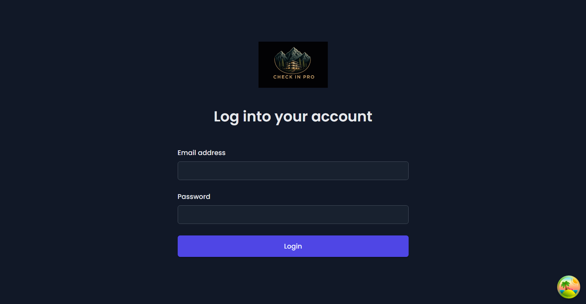
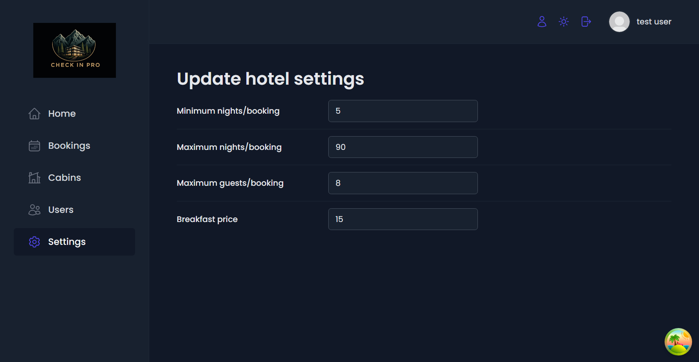

<div align="center">


# CheckInPro — Hotel Management Dashboard

### A full-stack hotel management system built with React and Supabase

[](https://check-in-pro-chi.vercel.app)
[](https://github.com/iamsyedbilal/checkInPro)



</div>

---

## About

CheckInPro is a full-featured hotel management dashboard that allows hotel staff to manage bookings, cabins, guests, and check-ins from one central location. Built as a real-world application with authentication, real-time data, and a polished dark/light mode UI.

---

## Features

- 🔐 **Authentication** — Secure login and signup with Supabase Auth
- 🏠 **Cabin Management** — Add, edit, delete cabins with image upload
- 📅 **Booking Management** — View, filter, and manage all bookings
- ✅ **Check-in / Check-out** — Process guest arrivals and departures
- 📊 **Dashboard Analytics** — Sales charts, occupancy rate, stay duration summary
- 🌙 **Dark / Light Mode** — Toggle with preference saved to localStorage
- 👤 **User Account** — Update profile, name, avatar and password
- ⚙️ **App Settings** — Configure breakfast price, min/max nights, max guests
- 🔍 **Filter & Sort** — Filter bookings by status, sort by date and amount
- 📄 **Pagination** — Paginated tables for bookings and cabins
- 🍞 **Toast Notifications** — Success and error feedback on all actions

---

## Screenshots

| Dashboard                           | Bookings                                 | Cabins                               |
| ----------------------------------- | ---------------------------------------- | ------------------------------------ |
|  |  |  |

| Light Mode                         | Login                              | Settings                                 |
| ---------------------------------- | ---------------------------------- | ---------------------------------------- |
|  |  |  |

---

## Built With


---

## Architecture

```
src/
├── context/          # Dark mode and auth context
├── data/             # Sample data upload scripts
├── features/         # Feature-based folder structure
│   ├── authentication/
│   ├── bookings/
│   ├── cabins/
│   ├── check-in-out/
│   ├── dashboard/
│   └── settings/
├── hooks/            # Custom reusable hooks
│   ├── useLocalStorageState.js
│   ├── useMoveBack.js
│   └── useOutsideClick.js
├── pages/            # Route-level page components
├── services/         # Supabase API service functions
│   ├── apiAuth.js
│   ├── apiBookings.js
│   ├── apiCabins.js
│   └── apiSettings.js
├── styles/           # Global styles and CSS variables
├── ui/               # Reusable UI components
│   ├── Modal.jsx     # Compound component pattern
│   ├── Table.jsx     # Compound component pattern
│   └── ...
└── utils/            # Helper functions
```

---

## Getting Started

### Prerequisites

- Node.js 18+
- Supabase

### Installation

````bash
# Clone the repo
git clone https://github.com/iamsyedbilal/checkInPro.git

# Navigate to project
cd checkInPro

# Install dependencies
npm install


```env
VITE_SUPABASE_URL=your_supabase_project_url
VITE_SUPABASE_ANON_KEY=your_supabase_anon_key
````

### Run locally

```bash
npm run dev
```

---

## What I Learned

- Building a full stack application with React and Supabase
- Managing server state with React Query (caching, mutations, invalidation)
- Compound component pattern for reusable Modal and Table components
- Custom hooks for reusable logic (useLocalStorageState, useOutsideClick)
- Row Level Security (RLS) policies in Supabase
- Protected routes with authentication state
- Image upload and storage with Supabase Storage buckets
- Dark and light mode with Context API and localStorage persistence
- Form handling and validation with React Hook Form
- Professional Git workflow with conventional commits

---

## Deployment

Deployed on **Vercel** with environment variables configured in the Vercel dashboard.

Supabase URL Configuration updated to allow the Vercel deployment URL.

---

## Author

**Syed Bilal**

[](https://www.frontendmentor.io/profile/iamsyedbilal)
[](https://github.com/iamsyedbilal)
[](https://x.com/SyedBilal200)

---

## Acknowledgments

This project was built as part of **Jonas Schmedtmann's Ultimate React Course** on Udemy. The original project concept belongs to Jonas — this is my implementation with custom branding as CheckInPro.

---

<div align="center">
  <sub>Built with ❤️ by Syed Bilal</sub>
</div>
